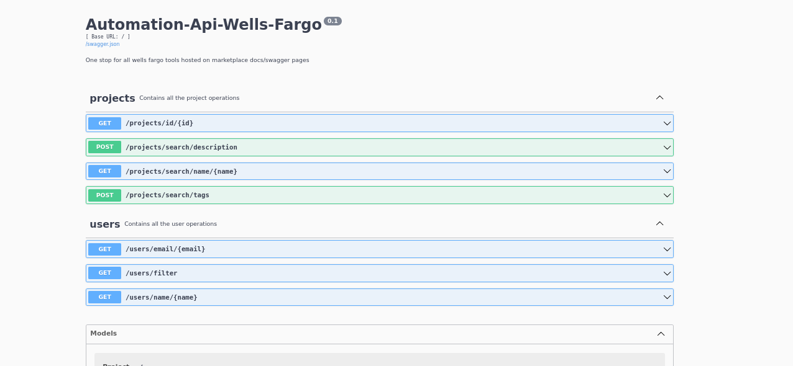
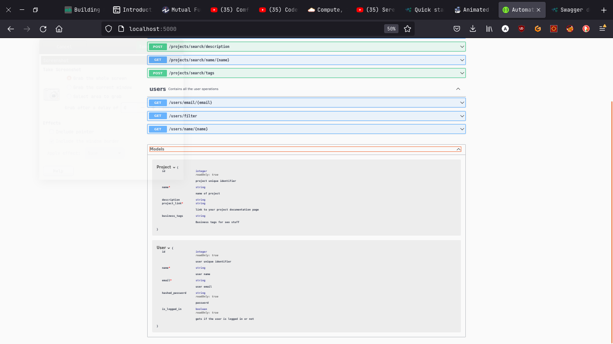

##Automation-readme: rest api for marketplace automation 

-This would be complemented by a webcrawler that would insert the relevant data into the sqlite.db and then this data would be served to the end-users by the http.server . 

#### Installation guidelines 

Download pdm from https://pdm.fming.dev/latest/
install pdm on your machine 
enable pep582. 
cd into the project directory and run pdm install first 
pdm install should run successfully

then run the following : 
- python manager.py create-db will create the schemas for you 
- python manager.py start-server will start the flask server and will show a swagger page at http://localhost:5000 

- python manager.py clean-db will clean all the tables without dropping the schema
- python manager.py drop-db will drop the entire database 

for more info run 
    python manager.py <subcommand> -help for each of these subcommands 

also can be run using the makefile present 

or you could use the dockerfile attached here to correctly run 

first build the image 
docker image . -t <image-name>

and then run the image 
docker run <image-name> 

